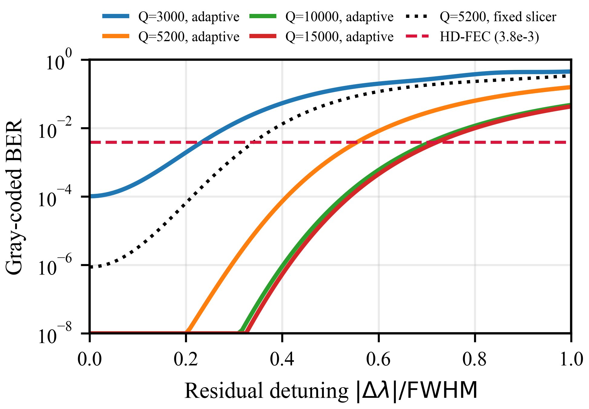
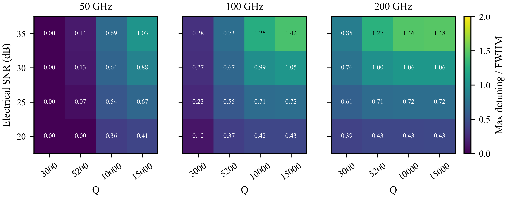
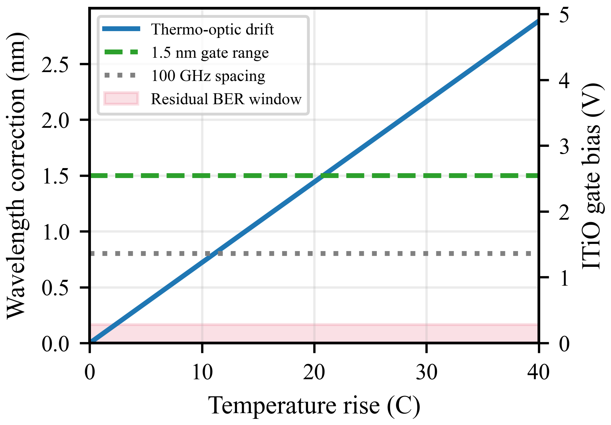
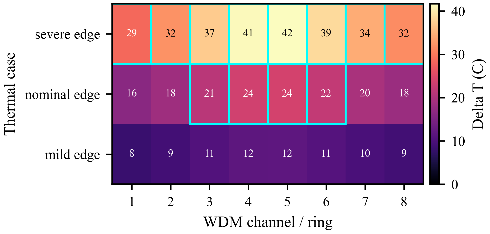
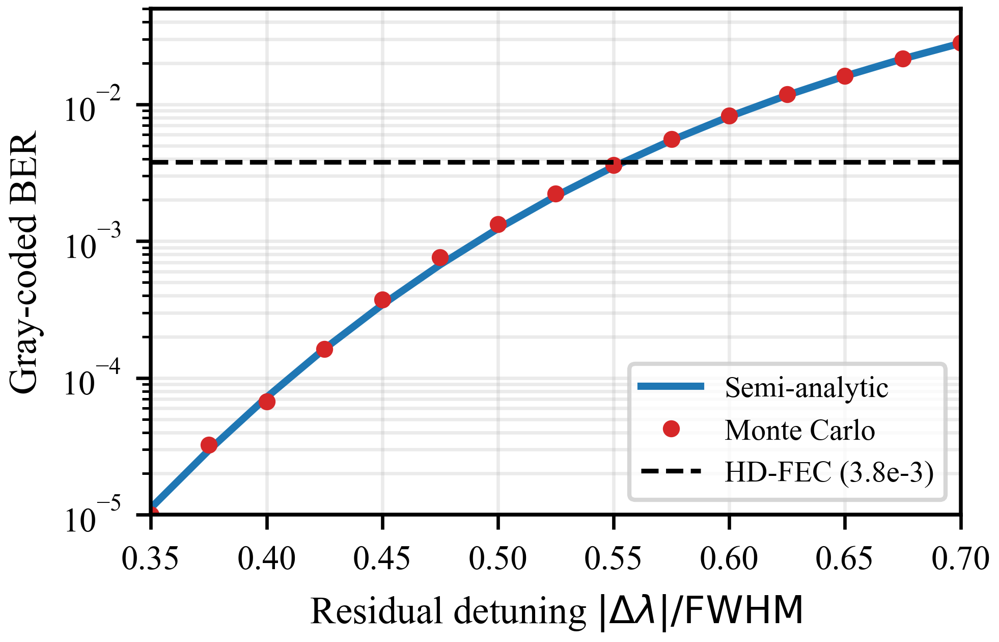

# Thermal Control Design Windows for Microring WDM Links in Co-Packaged AI Optical I/O

This repository accompanies a two-page IPC 2026-style paper on thermal control budgets for silicon microring resonator (MRR) WDM links in co-packaged AI optical I/O. The project asks a practical design question:

> After coarse thermal tuning, how accurately must an MRR resonance be held to preserve a PAM4 pre-FEC BER target?

The study uses a first-order, reproducible link model with Lorentzian ring filtering, WDM leakage, Gray-coded PAM4 bit-error counting, slicer-domain SNR, and illustrative package-informed thermal stress cases.

## Paper

- [Compiled PDF](thermal-control-design-windows/docs/ipc2026_FINAL.pdf)
- [LaTeX source](thermal-control-design-windows/docs/ipc2026_FINAL.tex)
- [Simulation script](thermal-control-design-windows/code/ipc2026_cpo_design_window.py)
- [Generated CSV/figure outputs](thermal-control-design-windows/figures/design_window/)

## Key Result

For a literature-reported `Q=5200` microring receiver at 100 GHz WDM spacing and 25 dB slicer SNR, the residual lock budget is about `101-165 pm`, depending on whether the receiver tracks the mean WDM-leakage pedestal. This corresponds to roughly `1.4-2.3 C` equivalent uncompensated silicon thermo-optic drift at `72 pm/C`.

## Figures

### BER Versus Residual Detuning



Residual resonance detuning is the control variable that matters after coarse tuning. The adaptive-pedestal case gives a wider lock window, while the fixed-slicer curve gives a more conservative receiver budget.

### Q, Spacing, and SNR Design Window



The heatmap summarizes how much residual detuning, in linewidths, remains below the nominal pre-FEC HD-FEC threshold for 50, 100, and 200 GHz WDM spacing. It shows the tradeoff between linewidth, WDM crosstalk, and receiver SNR.

### Tuning Requirement



Silicon's thermo-optic drift converts temperature rise into multi-nm wavelength correction. The plotted comparison separates coarse tuning range from the much smaller residual closed-loop lock accuracy needed for BER robustness.

### Package Thermal Stress Scenarios



Illustrative package-informed stress cases show how local photonic-layer temperature nonuniformity can vary across an eight-ring WDM engine. Cyan outlines mark cells exceeding the 1.5 nm fine-tuning range under the assumed 72 pm/C drift.

### Monte Carlo Cross-Check



The semi-analytic BER calculation is cross-checked against Monte Carlo PAM4 symbol streams with true Gray-coded bit-error counting near the HD-FEC crossing.

## Reproduce Figures

```powershell
python .\thermal-control-design-windows\code\ipc2026_cpo_design_window.py `
  --out-dir .\thermal-control-design-windows\figures\design_window
```

The script prints numerical sanity checks for:

- silicon thermo-optic drift near `72 pm/C`
- 100 GHz channel spacing near `0.80 nm` at 1550 nm
- `Q=5200` linewidth near `298 pm`
- adaptive and fixed-slicer residual detuning budgets

## Build Paper

```powershell
cd .\thermal-control-design-windows\docs
pdflatex -interaction=nonstopmode -halt-on-error ipc2026_FINAL.tex
pdflatex -interaction=nonstopmode -halt-on-error ipc2026_FINAL.tex
```

## Model Scope

This is a first-order link-level design study, not measured CPO hardware validation. The model includes Lorentzian MRR drop response, equal-power WDM leakage, Gray-coded PAM4 BER, slicer-domain AWGN, and optional imported thermal-map CSV support. It does not separately model OMA, RLM, photodiode responsivity, TIA bandwidth/noise, RIN, equalization, or control-loop dynamics.

## License

This project is released under the MIT License. See [LICENSE](LICENSE).
